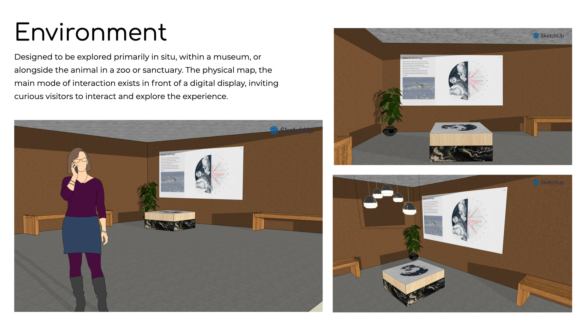
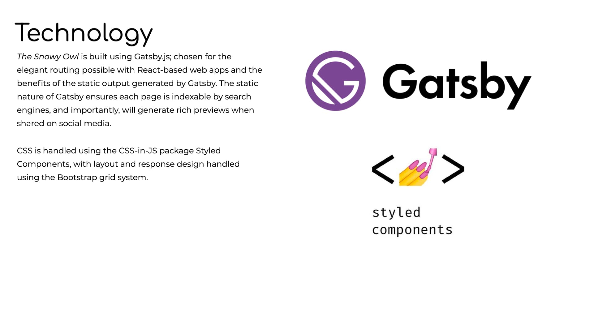

# The Snowy Owl 
## By Oliver Meredith

### To run this project locally: 

1. Ensure you have Node installed on your machine

2. Git clone the project onto your machine

3. Within your terminal, navigate to the directory of this project

4. Run npm install

5. Run gatsby develop

